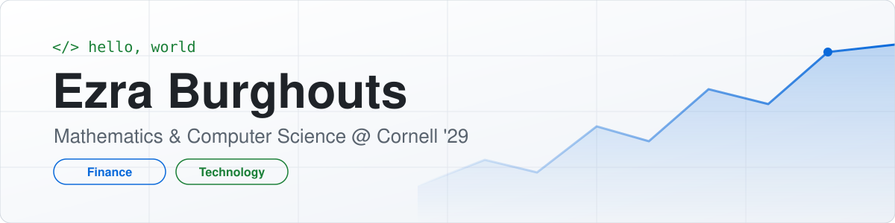

<picture>
 <source media="(prefers-color-scheme: dark)" srcset="banner-dark.svg">
 <source media="(prefers-color-scheme: light)" srcset="banner-light.svg">
 
</picture>

## About me

Hi, I'm Ezra. I am a student and new to Github.

My top Hobbies

| Rank | Hobbies       |
|-----:|---------------|
|     1|  Art          |
|     2|  Running      |
|     3|  Music        |

---
> Success is not final, failure is not fatal: it is the courage to continue that counts

- Winston Churchill

<!-- TO DO: add more details about me later -->

<!--
**ejb332-commits/ejb332-commits** is a ✨ _special_ ✨ repository because its `README.md` (this file) appears on your GitHub profile.

Here are some ideas to get you started:

- 🔭 I’m currently working on ...
- 🌱 I’m currently learning ...
- 👯 I’m looking to collaborate on ...
- 🤔 I’m looking for help with ...
- 💬 Ask me about ...
- 📫 How to reach me: ...
- 😄 Pronouns: ...
- ⚡ Fun fact: ...
-->
